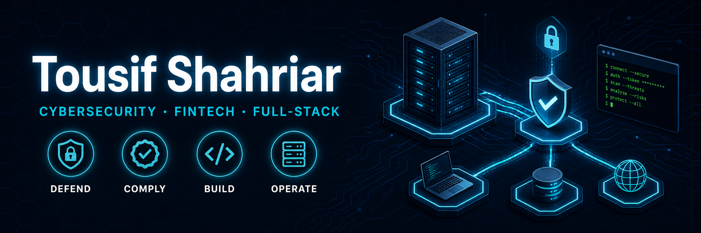

---

### About me

I build and operate full-stack web and mobile applications end-to-end, from the frontend down to the Raspberry Pi running production. I work as a DevOps Engineer at an Australian fintech, where I handle KYC compliance and AUSTRAC reporting alongside building a modern remittance platform.

Outside the day job, I'm focused on cybersecurity (currently studying for CCNA, training on TryHackMe), self-hosting my own infrastructure stack, and the kind of hands-on tinkering, custom firmware, reverse engineering, and hardware that started long before I had a CS degree. I lean heavily on AI-assisted workflows but make a point of understanding every line that ships.

### Tech I work with

**Languages**

**Frontend**

**Backend & Database**

**Mobile**

**DevOps & Infrastructure**

**Security & Networking**

**Auth & Crypto**

**CMS**

### Featured projects

* **Kovira** : offline-first encrypted personal ledger
  *Flutter, Dart, SQLite, Google Drive API, AES-256-CBC + PBKDF2*
  Cross-platform Android app for tracking daily transactions. Local-first storage, user-owned encrypted backups to Google Drive, Material 3 theming.
  → [`/Kovira`](https://github.com/Thypsos/Kovira)

* **Remittance Platform** *(in private development)* : modern fintech web app
  *Next.js 16, React, TypeScript, Tailwind · Node.js, PostgreSQL, Prisma · NextAuth + WebAuthn · Docker, Caddy*
  Full-stack money transfer platform with passkey authentication, dockerized deployment, and HTTPS via auto Let's Encrypt. Built for an Australian fintech, self-hosted on ARM64. Source private; happy to discuss architecture.

* **MDCS** : responsive cleaning services landing page
  *HTML5, CSS3, vanilla JS · GitHub Pages*
  Accessible nav, responsive grid, basic SEO.
  → [`/mdcs`](https://github.com/Thypsos/mdcs)

### Domain experience

KYC / Compliance (DVS, watchlist screening) · AUSTRAC reporting · Payment integrations (Stripe, PayPal, bKash) · Self-hosting & Homelab · Game server hosting

---

### Contact

